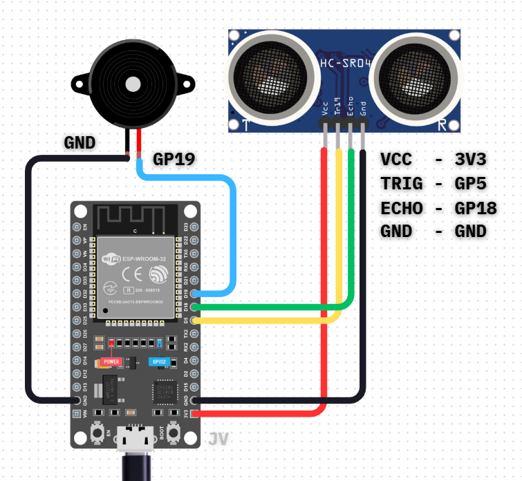

# TripwireESP
**ESP32 Tripwire Monitoring System with Web API**

This project is an ESP32-based smart tripwire system that detects objects using an HC-SR04 ultrasonic sensor. When something comes within 50 cm, a buzzer sounds and the system updates its state via a web API, allowing remote monitoring. It automatically connects to a Wi-Fi network or creates its own access point, making it ready for integration with automation platforms or notifications.

## Wiring Diagram

## Pinout

| Component | ESP32 Pin | Notes                     |
|-----------|-----------|---------------------------|
| **HC-SR04 VCC** | 3.3V       | Power supply             |
| **HC-SR04 Trig** | GPIO 5    | Trigger signal           |
| **HC-SR04 Echo** | GPIO 18   | Echo signal              |
| **HC-SR04 GND**  | GND       | Ground                   |
| **Buzzer GND**    | GND       | Ground                   |
| **Buzzer VCC**    | GPIO 19   | Output signal            |

## Features
- Real-time distance detection with HC-SR04  
- Audible alert via buzzer when object is within 50 cm  
- Web API endpoint `/status` returns JSON with distance and intruder state  
- Automatic Wi-Fi connection or AP fallback  
- Ready for integration with automation tools like N8N or email alerts  

## Usage
1. Upload the code to your ESP32.  
2. Connect HC-SR04 and buzzer according to the pinout.  
3. Power on the ESP32.  
4. Check Serial Monitor for Wi-Fi/AP connection details and API URL.  
5. Access the API via browser or automation platform:  
